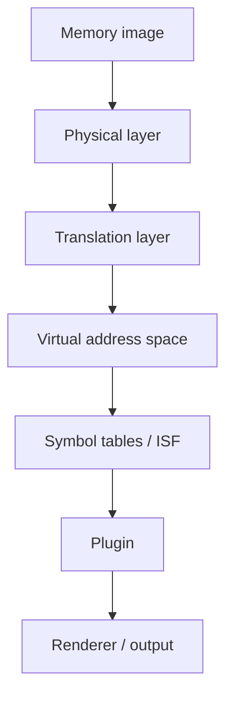

Volatility 3 is the world's most widely used framework for extracting digital artifacts from volatile memory (RAM) samples. This page introduces what Volatility 3 is, what makes it different from its predecessor, and how its architecture supports deep, OS-independent memory analysis.

## What is Volatility 3?

Volatility 3 operates completely independently of the system being investigated. Given a raw memory image captured from a running system, it reconstructs the runtime state — processes, network connections, loaded drivers, registry keys, and more — without executing any code on the target.

In 2019, the Volatility Foundation released Volatility 3 as a complete rewrite of the original framework. The rewrite resolved long-standing technical and performance limitations accumulated over a decade of development. It also introduced a cleaner plugin architecture, automatic symbol table resolution, and a redesigned Python library that can be embedded directly into your own tools and workflows.

<Note>
Volatility 3 is released under the Volatility Software License (VSL). See the [full license text](https://www.volatilityfoundation.org/license/vsl-v1.0) for details.
</Note>

## Key features

<CardGroup cols={2}>
  <Card title="OS-independent analysis" icon="shield-halved">
    Analyze Windows, Linux, and macOS memory images using the same CLI and plugin interface, without running code on the target system.
  </Card>
  <Card title="Automatic symbol resolution" icon="wand-magic-sparkles">
    Windows PDB files are downloaded and converted automatically. The automagic subsystem detects the OS, architecture, and loads the right symbol tables without manual configuration.
  </Card>
  <Card title="Extensible plugin system" icon="plug">
    Every analysis capability is a plugin. Build your own by inheriting from `PluginInterface`, defining requirements, and implementing a `run()` method.
  </Card>
  <Card title="Embeddable Python library" icon="python">
    Import Volatility 3 directly into your Python application to build custom forensics pipelines, automated triage tools, or SIEM integrations.
  </Card>
  <Card title="Multiple output formats" icon="table">
    Results render as text tables, JSON, CSV, or SQLite. Plug in a custom renderer to integrate with any downstream tool.
  </Card>
  <Card title="Active community" icon="users">
    Backed by the Volatility Foundation with an active contributor community, ongoing plugin development, and broad CTF and incident-response adoption.
  </Card>
</CardGroup>

## Architecture overview

Volatility 3 models memory as a directed graph of **layers**. A physical memory layer sits at the base. Translation layers — such as Intel's page table hierarchy — stack on top to provide virtual address spaces. Plugins operate on these virtual layers without needing to know the details of the underlying physical layout.

**Symbol tables** describe the data structures of a specific OS kernel version. They are stored as Intermediate Symbol Format (ISF) JSON files. For Windows, Volatility 3 can generate ISF files automatically from Microsoft's public PDB symbol server. For Linux and macOS, you generate them from the running kernel using tools such as [dwarf2json](https://github.com/volatilityfoundation/dwarf2json).

The **automagic** subsystem inspects a memory image and automatically selects appropriate layers, symbol tables, and configuration values. In most cases, you supply only the image path and a plugin name.

## Supported platforms

Volatility 3 supports memory images from:

- **Windows** — XP through Windows 11 and Server editions
- **Linux** — any kernel version with a matching symbol table
- **macOS** — Sierra through recent releases with a matching symbol table

## Get started

<CardGroup cols={3}>
  <Card title="Install" icon="download" href="/installation">
    Install Volatility 3 via pip or clone the repository for development.
  </Card>
  <Card title="Quickstart" icon="rocket" href="/quickstart">
    Run your first memory analysis in minutes with a real memory image.
  </Card>
  <Card title="Windows tutorial" icon="windows" href="/tutorials/windows">
    Step-by-step guide using a real Windows memory dump.
  </Card>
</CardGroup>
